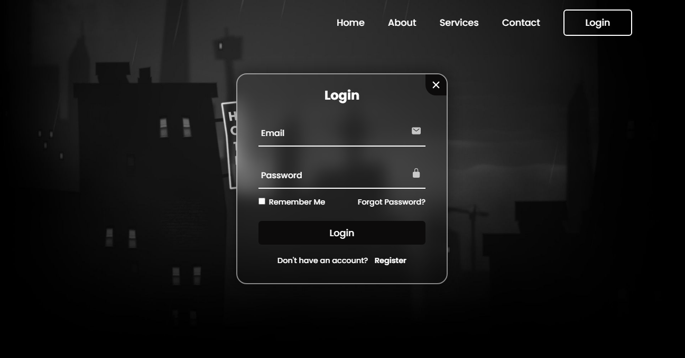

<p align="center"></p>
<p align="center"></p>
<h3 align="center">A Simple and User-Friendly Platform for Seamless Authentication</h3>
<hr>

<div align="center">


</div>

## About this Project

Login & SignUp Website is a streamlined platform designed to facilitate easy user authentication. With a focus on simplicity and security, this project provides a user-friendly interface for creating accounts and logging in. Ideal for integrating into larger web applications or for standalone use.

Check out the live demo [here](https://amit712singhal.github.io/Login-SignUp-Website/).

## Preview



<details>
     <summary><h2>Table of Contents</h2></summary>

- [About this Project](#about-this-project)
- [Preview](#preview)
- [Installation](#installation)
- [Usage](#usage)
- [Features](#features)
- [Technologies Used](#technologies-used)
- [Contributing](#contributing)
- [Connect with Me](#connect-with-me)
- [License](#license)
</details>

## Installation

To run this project locally, follow these steps:

1. **Clone the repository**

   ```sh
   git clone https://github.com/amit712singhal/Login-SignUp-Website.git
   cd Login-SignUp-Website
   ```

2. **Open index.html in your web browser**

      You can either open the index.html file directly in your browser or use a local server like [Live Server](https://marketplace.visualstudio.com/items?itemName=ritwickdey.LiveServer) in VSCode to serve the files.

## Usage

1. **Open the Login Form**

     After opening the application, click on the "Login" button. This will trigger a popup with the login form.

2. **Access the Registration Form**

     If you don't have an account, click on the "Don't have an account? Register" link within the login form. This will switch the popup to display the registration form.

3. **Form Submission**

     You can fill in the details and submit the form, but note that the current version does not perform any authentication upon submission.

## Features

- Seamless User Registration and Login
- User-Friendly Interface
- Profile Management
- Responsive Design

## Technologies Used

<div style="display: flex; flex-wrap: wrap; gap: 5px;">
     
     
     
</div>

## Contributing

Contributions to this project are welcome! If you find any bugs or have suggestions for improvements, please create an issue or submit a pull request.

1. Fork the repository.
2. Create your feature branch (`git checkout -b feature/YourFeature`).
3. Commit your changes (`git commit -am 'Add some feature'`).
4. Push to the branch (`git push origin feature/YourFeature`).
5. Create a new Pull Request.

## Connect with Me

I love connecting with new people and exploring new opportunities. Feel free to reach out to me through any of the platforms below:

<table>
    <tr>
        <td>
            <a href="https://github.com/amit712singhal">
                
            </a>
        </td>
        <td>
            <a href="https://www.linkedin.com/in/singhal-amit/">
                
            </a>
        </td>
        <td>
            <a href="https://www.instagram.com/_singhal_amit/" target="blank"></a>
        </td>
        <td>
            <a href="mailto:rakshit.singhal712@gmail.com">
                
            </a>
        </td>
    </tr>
</table>

## License

This project is licensed under the MIT License. See the [LICENSE](LICENSE) file for details.
